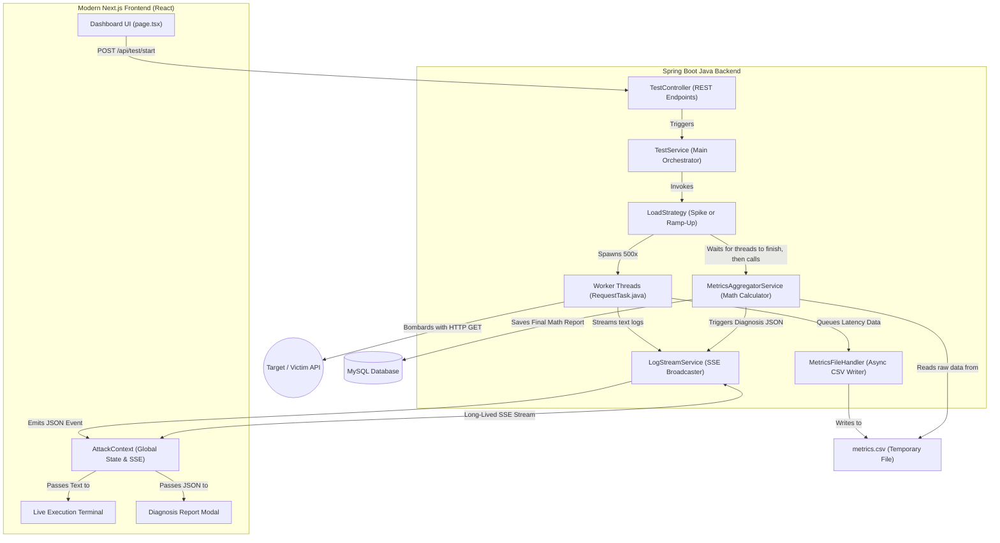

# AeroLoad Master Guide: The Ultimate Blueprint

Welcome to the core documentation for **AeroLoad**! This guide is written so simply that a high school student—or anyone entirely new to programming—can understand exactly how this massive high-concurrency engine works.

Below you will find a list of advanced Java features you can discuss during your Viva evaluation, a complete architectural diagram of how data flows, and an exhaustive, file-by-file breakdown of what every single line of code in the frontend and backend does.

---

## 🎓 Viva Preparation: Advanced Java Features Used
If your professor or examiner asks what you learned or what advanced Java features are powering the backend of AeroLoad, here are the major topics you should highlight:

1. **Concurrency Control & Multithreading (`java.util.concurrent`)**
   * **`ExecutorService` & Thread Pools:** We don't just create random threads; we use `Executors.newFixedThreadPool()` to launch and safely manage hundreds of worker threads at the exact same exact millisecond without running out of RAM or crashing the JVM.
   * **`Runnable` Interface:** Our [RequestTask.java](file:///Users/jaimin/AeroLoad/backend/src/main/java/com/aeroload/engine/RequestTask.java) implements this interface to define the "job" that each individual simulated user executes.
   * **Atomic Variables (`AtomicInteger`, `AtomicBoolean`):** When 500 threads hit the server at once, they might all get failure codes simultaneously. If they all tried to add `+1` to a normal integer at the same time, we would get race conditions (miscounts). We used `AtomicInteger` to guarantee thread-safe counting across multiple CPU cores without using slow `synchronized` locks.
2. **Server-Sent Events (SSE) via Spring Boot's `SseEmitter`**
   * Instead of the frontend constantly polling the backend asking "Are there any new logs?" every 5 seconds, the server holds open a single, long-lived HTTP connection and mathematically *pushes* the logs down to the browser automatically, updating the live terminal instantly.
3. **Object-Oriented Design (Polymorphism & Interfaces)**
   * We created a single `LoadStrategy` Interface. Both our [SpikeTestStrategy](file:///Users/jaimin/AeroLoad/backend/src/main/java/com/aeroload/engine/SpikeTestStrategy.java#15-121) and [RampUpTestStrategy](file:///Users/jaimin/AeroLoad/backend/src/main/java/com/aeroload/engine/RampUpTestStrategy.java#15-126) implement this interface. This allows the master [TestService](file:///Users/jaimin/AeroLoad/backend/src/main/java/com/aeroload/service/TestService.java#12-81) to dynamically run either attack type without caring about the underlying code logic!
4. **Spring Data JPA / Hibernate (Database ORM)**
   * We used Java Persistence API (JPA) via `@Entity` annotations. Rather than writing raw, messy SQL queries like `INSERT INTO...`, we map literal Java objects ([AggregatedMetrics](file:///Users/jaimin/AeroLoad/backend/src/main/java/com/aeroload/model/AggregatedMetrics.java#5-52)) directly to MySQL tables. Spring Boot automatically translates and saves our objects to the MySQL database.
5. **Asynchronous I/O File Handling (`BlockingQueue`)**
   * Thousands of threads pausing their attack to write their latency results to the hard drive would cause a severe bottleneck. Instead, running threads instantly drop their results into a super-fast in-memory `BlockingQueue`. A single, isolated background "Daemon Thread" sequentially drains this queue and writes it securely to the [metrics.csv](file:///Users/jaimin/AeroLoad/backend/metrics.csv) disk file.

---

## 🗺️ System Architecture Data Flow

Here is a visual representation of how the React Frontend commands the Spring Boot Backend to annihilate the Victim API, and how logs and mathematical reports flow back to your screen.

---

## 🗄️ Backend Code: File-By-File Breakdown

Imagine the backend server is a strictly organized military base designed for one purpose: launching coordinated air strikes on an API.

### 1. Controllers & Configurations (The Gatekeepers)
* **[AeroLoadApplication.java](file:///Users/jaimin/AeroLoad/backend/src/main/java/com/aeroload/AeroLoadApplication.java)**: The absolute starting point. It contains the `public static void main(String[] args)` method. Running this file boots up the embedded Tomcat web server and initializes the entire Spring application.
* **[CorsConfig.java](file:///Users/jaimin/AeroLoad/backend/src/main/java/com/aeroload/config/CorsConfig.java)**: Web browsers have strict security preventing a website on port 3000 from talking to a backend on port 8080. This file configures Cross-Origin Resource Sharing (CORS), telling the backend "It is perfectly safe to accept requests from our Next.js frontend."
* **[TestController.java](file:///Users/jaimin/AeroLoad/backend/src/main/java/com/aeroload/controller/TestController.java)**: The receptionist. It catches incoming HTTP network requests over the internet.
  * When Vue/React says `POST /api/test/start`, it routes it to the start method.
  * When React asks for `GET /api/test/stream`, it registers the browser into the [LogStreamService](file:///Users/jaimin/AeroLoad/backend/src/main/java/com/aeroload/service/LogStreamService.java#13-93) broadcaster.
  * When React says `POST /api/test/stop`, it triggers the manual abort sequence.

### 2. Services (The Commanders)
* **[TestService.java](file:///Users/jaimin/AeroLoad/backend/src/main/java/com/aeroload/service/TestService.java)**: The main orchestration general! When it receives a "Start" command from the Controller, it creates a new [TestRun](file:///Users/jaimin/AeroLoad/backend/src/main/java/com/aeroload/model/TestRun.java#6-35) database record, figures out if you wanted a Spike or Ramp-Up test, and fires off a new background Thread to execute the attacking strategy. It also checks if an attack is already running to prevent you from accidentally starting two overriding attacks simultaneously.
* **[AttackStateService.java](file:///Users/jaimin/AeroLoad/backend/src/main/java/com/aeroload/service/AttackStateService.java)**: The global whiteboard in the command room. It simply holds boolean flags ([isRunning](file:///Users/jaimin/AeroLoad/backend/src/main/java/com/aeroload/service/AttackStateService.java#21-24), `abortRequested`). If you hit the "Abort Attack" button, it sets `abortRequested = true`. All the running worker threads constantly look at this whiteboard, and if they see it flip to true, they immediately drop their weapons and stop attacking.
* **[LogStreamService.java](file:///Users/jaimin/AeroLoad/backend/src/main/java/com/aeroload/service/LogStreamService.java)**: The radio broadcaster tower. It manages the `SseEmitter` connections for all open browser tabs. When a worker thread encounters an error or finishes a task, it tells this service: "Broadcast this string!" and the service instantly beams it down the open HTTP pipeline straight into your React application so you can see it in real-time on your screen.

### 3. The Engine (The Attack Choppers & Foot Soldiers)
* **[SpikeTestStrategy.java](file:///Users/jaimin/AeroLoad/backend/src/main/java/com/aeroload/engine/SpikeTestStrategy.java)**: The "Shock and Awe" tactic. It instantly generates the `ExecutorService` thread pool and dumps all 500 users onto the target URL at the exact same millisecond to see if the victim server crashes under sudden shock. Once it finishes, it waits for the CSV writer to finish its job, then commands the Mathematician ([MetricsAggregatorService](file:///Users/jaimin/AeroLoad/backend/src/main/java/com/aeroload/service/MetricsAggregatorService.java#16-122)) to calculate the final grade.
* **[RampUpTestStrategy.java](file:///Users/jaimin/AeroLoad/backend/src/main/java/com/aeroload/engine/RampUpTestStrategy.java)**: The "Slow Cooker" tactic. Instead of dumping all users at once, it calculates a mathematical delay and slowly introduces users one by one over time. This helps you figure out *exactly* at what user-count the victim server begins to sweat and collapse.
* **[RequestTask.java](file:///Users/jaimin/AeroLoad/backend/src/main/java/com/aeroload/engine/RequestTask.java)**: The literal Foot Soldier. When you ask for 500 users, Java actually creates 500 distinct instances of this class. The [run()](file:///Users/jaimin/AeroLoad/backend/src/main/java/com/aeroload/engine/RequestTask.java#41-87) loop does exactly three things over and over again until the timer runs out:
  1. Opens an HTTP connection to the Victim API.
  2. Uses a stopwatch (`System.currentTimeMillis()`) to time exactly how many milliseconds the victim took to respond.
  3. Hands that latency number and the status code (e.g. 200 OK or 500 Error) over to the [MetricsFileHandler](file:///Users/jaimin/AeroLoad/backend/src/main/java/com/aeroload/engine/MetricsFileHandler.java#15-91).
* **[MetricsFileHandler.java](file:///Users/jaimin/AeroLoad/backend/src/main/java/com/aeroload/engine/MetricsFileHandler.java)**: The fast-typing scribe. Rather than letting 500 attacking threads get bottlenecked fighting over who gets to write to the hard drive, they all drop their numbers into a volatile `BlockingQueue`. This file creates a completely isolated Daemon Thread that loops forever, grabbing items out of the queue and writing them smoothly block-by-block into the [metrics.csv](file:///Users/jaimin/AeroLoad/backend/metrics.csv) file without delaying the attack.

### 4. Models & Repositories (The Data Vault)
* **[TestRun.java](file:///Users/jaimin/AeroLoad/backend/src/main/java/com/aeroload/model/TestRun.java)**: A standard JPA `@Entity`. It represents a single execution you triggered (recording the Date, Strategy used, Users, and Duration). Hibernate automatically translates this Java class into a MySQL table column-by-column.
* **[AggregatedMetrics.java](file:///Users/jaimin/AeroLoad/backend/src/main/java/com/aeroload/model/AggregatedMetrics.java)**: Another `@Entity`. It stores the final calculated math (Total Errors, 95th Percentile Latency, whether the attack "PASSED" or "FAILED"). It is linked to the [TestRun](file:///Users/jaimin/AeroLoad/backend/src/main/java/com/aeroload/model/TestRun.java#6-35) using a One-to-One SQL relationship.
* **[TestRunRepository.java](file:///Users/jaimin/AeroLoad/backend/src/main/java/com/aeroload/repository/TestRunRepository.java) & [AggregatedMetricsRepository.java](file:///Users/jaimin/AeroLoad/backend/src/main/java/com/aeroload/repository/AggregatedMetricsRepository.java)**: Spring Boot magic interfaces. We didn't have to write any code inside them; by simply inheriting from `JpaRepository`, Spring automatically generates all the SQL queries required to save or retrieve records from our MySQL database.
* **[MetricsAggregatorService.java](file:///Users/jaimin/AeroLoad/backend/src/main/java/com/aeroload/service/MetricsAggregatorService.java)**: The Mathematician. Once the guns stop firing, this service kicks in. It manually opens the raw [metrics.csv](file:///Users/jaimin/AeroLoad/backend/metrics.csv) file containing tens of thousands of rows. It counts exactly how many were errors, calculates the Average Latency, and sorts the array to find the P95 (95th percentile) worst-case latency. It then packages all this math into an [AggregatedMetrics](file:///Users/jaimin/AeroLoad/backend/src/main/java/com/aeroload/model/AggregatedMetrics.java#5-52) entity and permanently `.save()`s it to MySQL.

---

## 💻 Frontend Code: File-By-File Breakdown

The presentation layer built with Next.js, explicitly using the new modern App Router structure alongside Tailwind CSS for stunning visual design.

### 1. The Global State (The Brain)
* **[lib/AttackContext.tsx](file:///Users/jaimin/AeroLoad/frontend/src/lib/AttackContext.tsx)**: The core nervous system of the entire React app. 
  * It utilizes the React Context API so that variables can be shared across all pages without "prop drilling". 
  * It holds the literal `EventSource` connection to the Java backend. If the Java server crashes and reboots, this file handles the exponential backoff to automatically reconnect. 
  * It maintains the huge array of live streaming `logs`, and the `diagnosisReport` JSON object when an attack finishes.
* **[app/dashboard/layout.tsx](file:///Users/jaimin/AeroLoad/frontend/src/app/dashboard/layout.tsx)**: This acts as a fixed visual wrapper for your entire web interface. It renders the Sidebar menu on the left side, and most importantly, it wraps the `<AttackProvider>` around your entire application. This ensures that when you click a link to jump from the Dashboard page to the Terminal page, React does *not* unload the SSE network connection!

### 2. The Views (What You See)
* **[app/dashboard/page.tsx](file:///Users/jaimin/AeroLoad/frontend/src/app/dashboard/page.tsx)**: The main Mission Control interface.
  * Inputs at the bottom update standard React `useState()` variables (`targetUrl`, `concurrentUsers`).
  * Uses complex Tremor `<Card>`, `<Metric>`, `<LineChart>`, and `<DonutChart>` components.
  * It contains a specialized React `useMemo` block that constantly watches the global `logs` array and uses Regex to extract millisecond latency numbers, instantly redrawing the beautiful charts on your screen in real time.
* **[app/dashboard/terminal/page.tsx](file:///Users/jaimin/AeroLoad/frontend/src/app/dashboard/terminal/page.tsx)**: The scary hacker terminal. It imports the global `logs` and maps over them entirely to produce green, blue, and red text on a black background. It utilizes a React `useRef` paired with `useEffect` to force the window to automatically scroll to the absolute bottom every time a new log line arrives from the backend.

### 3. The Polish
* **[components/DiagnosisReport.tsx](file:///Users/jaimin/AeroLoad/frontend/src/components/DiagnosisReport.tsx)**: The beautiful pop-up Modal that appears when an attack concludes.
  * It takes the finalized JSON math produced by the Java backend and runs it against threshold checks (`P95_LAT_WARN = 800`). 
  * Based on how badly the Victim API performed, it conditionally colors its components Red, Amber, or Emerald.
  * Using Framer Motion, it animates springing onto the screen (`layoutId` spring physics).
  * Most importantly, it parses the exact `First Failure Type` (e.g. if the victim server returned `HTTP 503`), and conditionally renders a `Recommended Actions` list (such as suggesting the developer increase their Database Connection Pool size to prevent 503 exhaustion).
