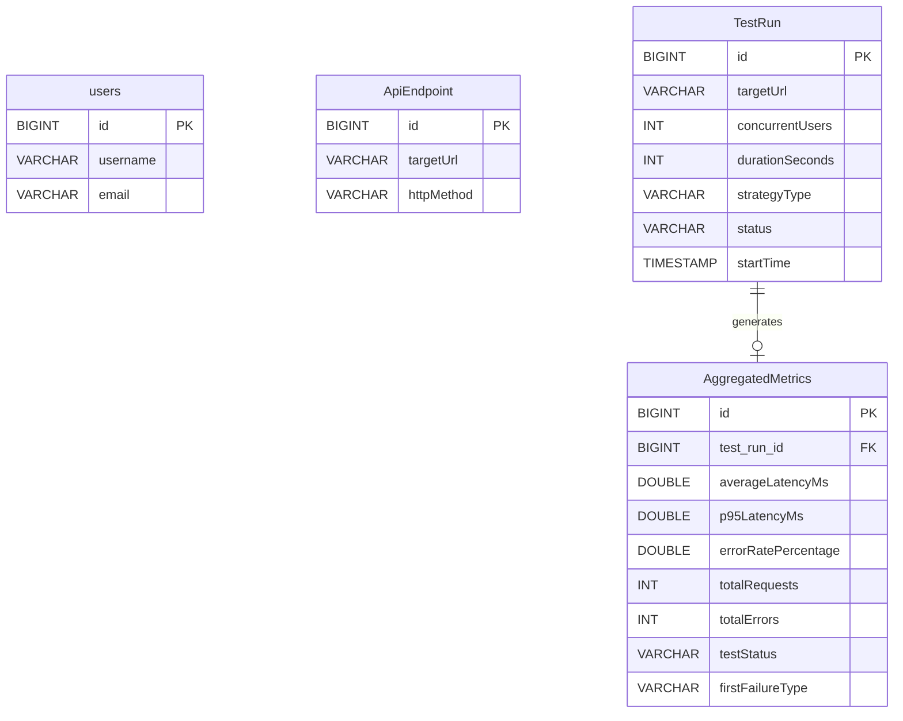

# Database Design Report: AeroLoad

## 1. Database Schema Structure

Based on a detailed scan of the AeroLoad Java entity classes (JPA/Hibernate), the following database schema structure has been extracted.

### Table: `users`
Mapped from `User.java` (`@Table(name = "users")`).
| Column Name | Data Type    | Constraints                  | Keys |
|-------------|--------------|------------------------------|------|
| `id`        | BIGINT       | NOT NULL, AUTO_INCREMENT     | PK   |
| `username`  | VARCHAR(255) |                              |      |
| `email`     | VARCHAR(255) |                              |      |

### Table: `ApiEndpoint`
Mapped from `ApiEndpoint.java`.
| Column Name  | Data Type    | Constraints                  | Keys |
|--------------|--------------|------------------------------|------|
| `id`         | BIGINT       | NOT NULL, AUTO_INCREMENT     | PK   |
| `targetUrl`  | VARCHAR(255) |                              |      |
| `httpMethod` | VARCHAR(255) |                              |      |

### Table: `TestRun`
Mapped from `TestRun.java`.
| Column Name       | Data Type    | Constraints                  | Keys |
|-------------------|--------------|------------------------------|------|
| `id`              | BIGINT       | NOT NULL, AUTO_INCREMENT     | PK   |
| `targetUrl`       | VARCHAR(255) |                              |      |
| `concurrentUsers` | INT          | NOT NULL                     |      |
| `durationSeconds` | INT          | NOT NULL                     |      |
| `strategyType`    | VARCHAR(255) |                              |      |
| `status`          | VARCHAR(255) |                              |      |
| `startTime`       | TIMESTAMP    |                              |      |

### Table: `AggregatedMetrics`
Mapped from `AggregatedMetrics.java`.
| Column Name           | Data Type    | Constraints                  | Keys |
|-----------------------|--------------|------------------------------|------|
| `id`                  | BIGINT       | NOT NULL, AUTO_INCREMENT     | PK   |
| `test_run_id`         | BIGINT       |                              | FK   |
| `averageLatencyMs`    | DOUBLE       | NOT NULL                     |      |
| `p95LatencyMs`        | DOUBLE       | NOT NULL                     |      |
| `errorRatePercentage` | DOUBLE       | NOT NULL                     |      |
| `totalRequests`       | INT          | NOT NULL                     |      |
| `totalErrors`         | INT          | NOT NULL                     |      |
| `testStatus`          | VARCHAR(255) |                              |      |
| `firstFailureType`    | VARCHAR(255) |                              |      |

---

## 2. Entity Relationships & Cardinality

Below are the explicit relationships defined in the scanned entity classes.

*Note: The prompt provided an example of a relationship between `User` and `TestConfiguration` / `TestRun`, however, **these relationships do not structurally exist in the currently parsed codebase**. The entities `User` and `ApiEndpoint` are currently isolated from `TestRun`. The only explicit JPA relationship in the codebase is between `AggregatedMetrics` and `TestRun`.*

### `TestRun` to `AggregatedMetrics`
- **Relationship Type**: One-to-One (`@OneToOne` mapped by `test_run_id` in `AggregatedMetrics`).
- **Cardinality**: `1:1`. One `TestRun` produces at most one `AggregatedMetrics` record.
- **Participation**:
  - **`TestRun`**: *Partial Participation*. A `TestRun` can exist without `AggregatedMetrics` (e.g., when the test is in "Pending" or "Running" status and metrics haven't been aggregated yet).
  - **`AggregatedMetrics`**: *Total Participation*. An `AggregatedMetrics` record must be tied to a specific `TestRun` footprint to be valid.

---

## 3. Entity-Relationship (ER) Diagram

---

## 4. Normalization Analysis

### First Normal Form (1NF)
**Criteria:** All attributes must be atomic, each cell containing a single value, and records must be uniquely identifiable.
**Analysis:** Every table defined possesses an explicit scalar `id` (`@Id @GeneratedValue`) as its Primary Key. No repeating groups or arrays exist within the Java classes. Fields such as `targetUrl`, `strategyType`, and numerical metrics are treated as discrete, indivisible units, effectively satisfying **1NF**.

### Second Normal Form (2NF)
**Criteria:** The schema must be in 1NF, and all non-key attributes must be fully functionally dependent on the entire primary key (no partial dependencies).
**Analysis:** Since every table relies on a *single-column surrogate key* (`id`), it is mathematically impossible for a partial dependency to exist. Non-key attributes uniquely depend strictly on the solitary `id` key. Therefore, the schema inherently satisfies **2NF**.

### Third Normal Form (3NF) & Boyce-Codd Normal Form (BCNF)
**Criteria:** The schema must be in 2NF, and there must be no transitive dependencies (non-key attributes depending on other non-key attributes). Alternatively for BCNF, every determinant must be a candidate key.
**Analysis:**
1. **`users`, `ApiEndpoint`, `TestRun`**: These tables are in **3NF/BCNF**. Attributes such as `username`, `targetUrl`, and `startTime` independently rely directly on their respective Primary Keys without interdependency among themselves.
2. **`AggregatedMetrics` (Violates 3NF/BCNF):**
   - Transitive Dependency: `errorRatePercentage` is a mathematically deterministic value derived from `totalErrors` and `totalRequests` (`totalErrors / totalRequests * 100`). Hence, `errorRatePercentage` is functionally dependent on non-key attributes.
   - **Architectural Decision (Intentional Denormalization):** This 3NF violation is an **explicitly strategic denormalization**. By pre-calculating and persisting aggregated metrics (like `errorRatePercentage`, `averageLatencyMs`, and `p95LatencyMs`) directly into the `AggregatedMetrics` table, the platform completely sidesteps the need to perform expensive, on-the-fly computational `JOIN`s and aggregations over millions of raw request logs during real-time analytics. This optimization ensures dashboards can render O(1) reads for test reports.
